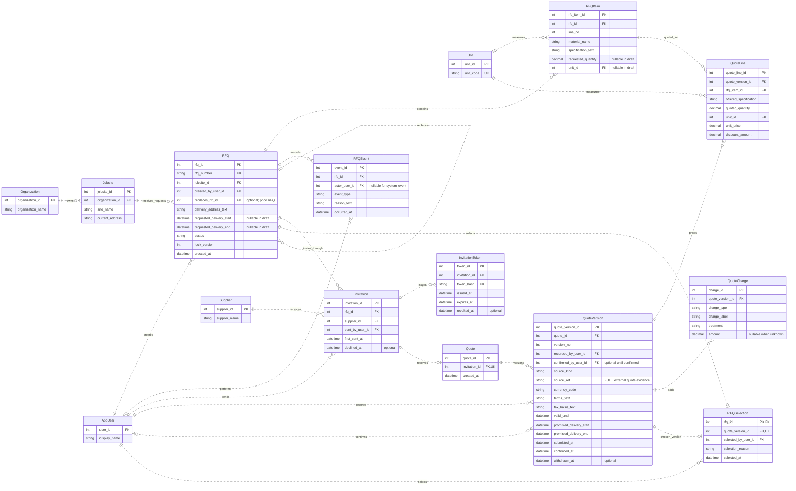

# BuildSupply Hub ER Model

RFQ model from Page-2 of `BuildSupply Hub Sitemap.drawio`.

```mermaid
erDiagram
    direction LR
    Organization ||..o{ Jobsite : owns
    Jobsite ||..o{ RFQ : receives_requests
    AppUser ||..o{ RFQ : creates
    RFQ ||..o{ RFQItem : contains
    Unit o|..o{ RFQItem : measures
    RFQ ||..o{ RFQEvent : records
    AppUser o|..o{ RFQEvent : performs
    RFQ o|..o{ RFQ : replaces
    RFQ ||..o{ Invitation : invites_through
    Supplier ||..o{ Invitation : receives
    AppUser ||..o{ Invitation : sends
    Invitation ||..o{ InvitationToken : issues
    Invitation ||..o| Quote : receives
    Quote ||..o{ QuoteVersion : versions
    AppUser ||..o{ QuoteVersion : records
    AppUser o|..o{ QuoteVersion : confirms
    QuoteVersion ||..o{ QuoteLine : prices
    RFQItem ||..o{ QuoteLine : quoted_for
    Unit ||..o{ QuoteLine : measures
    QuoteVersion ||..o{ QuoteCharge : adds
    RFQ ||..o| RFQSelection : selects
    QuoteVersion ||..o| RFQSelection : chosen_version
    AppUser ||..o{ RFQSelection : selects

    Organization {
        int organization_id PK
        string organization_name
    }
    AppUser {
        int user_id PK
        string display_name
    }
    Jobsite {
        int jobsite_id PK
        int organization_id FK
        string site_name
        string current_address
    }
    Unit {
        int unit_id PK
        string unit_code UK
    }
    RFQ {
        int rfq_id PK
        string rfq_number UK
        int jobsite_id FK
        int created_by_user_id FK
        int replaces_rfq_id FK "optional; prior RFQ"
        string delivery_address_text
        datetime requested_delivery_start "nullable in draft"
        datetime requested_delivery_end "nullable in draft"
        string status
        int lock_version
        datetime created_at
    }
    RFQItem {
        int rfq_item_id PK
        int rfq_id FK
        int line_no
        string material_name
        string specification_text
        decimal requested_quantity "nullable in draft"
        int unit_id FK "nullable in draft"
    }
    RFQEvent {
        int event_id PK
        int rfq_id FK
        int actor_user_id FK "nullable for system event"
        string event_type
        string reason_text
        datetime occurred_at
    }
    Supplier {
        int supplier_id PK
        string supplier_name
    }
    Invitation {
        int invitation_id PK
        int rfq_id FK
        int supplier_id FK
        int sent_by_user_id FK
        datetime first_sent_at
        datetime declined_at "optional"
    }
    InvitationToken {
        int token_id PK
        int invitation_id FK
        string token_hash UK
        datetime issued_at
        datetime expires_at
        datetime revoked_at "optional"
    }
    Quote {
        int quote_id PK
        int invitation_id FK, UK
        datetime created_at
    }
    QuoteVersion {
        int quote_version_id PK
        int quote_id FK
        int version_no
        int recorded_by_user_id FK
        int confirmed_by_user_id FK "optional until confirmed"
        string source_kind
        string source_ref "FULL: external quote evidence"
        string currency_code
        string terms_text
        string tax_basis_text
        datetime valid_until
        datetime promised_delivery_start
        datetime promised_delivery_end
        datetime submitted_at
        datetime confirmed_at
        datetime withdrawn_at "optional"
    }
    QuoteLine {
        int quote_line_id PK
        int quote_version_id FK
        int rfq_item_id FK
        string offered_specification
        decimal quoted_quantity
        int unit_id FK
        decimal unit_price
        decimal discount_amount
    }
    QuoteCharge {
        int charge_id PK
        int quote_version_id FK
        string charge_type
        string charge_label
        string treatment
        decimal amount "nullable when unknown"
    }
    RFQSelection {
        int rfq_id PK, FK
        int quote_version_id FK, UK
        int selected_by_user_id FK
        string selection_reason
        datetime selected_at
    }
```
